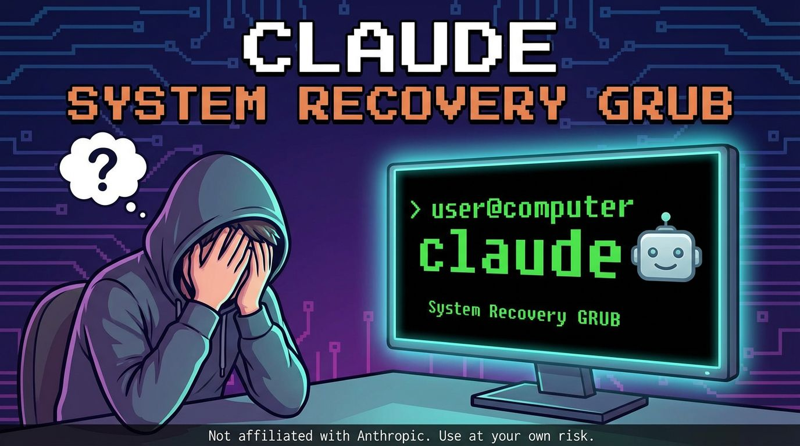

A custom GRUB boot entry that provides AI-assisted system recovery using [Claude CLI](https://claude.ai/download).

Instead of booting into a blank recovery shell, this mode launches directly into Claude CLI, giving you an intelligent assistant to help diagnose and fix system issues.

## Features

- **GRUB Boot Entry**: Adds "Claude Recovery Mode" to your boot menu
- **Minimal Boot**: Boots to a text-only TTY (no GUI overhead)
- **Auto-Login**: Automatically logs in as your specified user
- **Claude CLI**: Launches Claude immediately upon login
- **Network Enabled**: Boots with networking for Claude API access
- **Auto-Install**: If Claude CLI isn't installed, it will attempt to install it automatically

## Requirements

- Ubuntu/Debian-based Linux distribution
- systemd
- GRUB2 bootloader
- Internet connection (for Claude API)
- Anthropic API key configured for Claude CLI

## Installation

```bash
# Clone the repository
git clone https://github.com/danielrosehill/Claude-System-Recovery-Mode.git
cd Claude-System-Recovery-Mode

# Install with your current user (recommended)
sudo ./install.sh

# Or specify a different user
sudo ./install.sh --user myusername

# Or use root (use with caution)
sudo ./install.sh --root
```

## Usage

1. Reboot your system
2. At the GRUB menu, select **"Claude Recovery Mode"**
3. The system will boot to a minimal TTY environment
4. A warning banner will be displayed
5. Claude CLI will start automatically at the root directory (`/`)

### Within Claude Recovery Mode

- Use Claude to diagnose system issues, fix configurations, repair packages, etc.
- Type `exit` or press `Ctrl+C` to exit Claude and return to a shell
- Type `/help` within Claude for available commands

### Example Recovery Tasks

```
"My system won't boot normally. Can you check the systemd journal for errors?"

"The network isn't working. Can you check the network configuration?"

"I think I broke my fstab. Can you check and fix it?"

"Check if there are any failed systemd services and help me fix them."
```

## Uninstallation

```bash
sudo ./uninstall.sh
```

## How It Works

1. **GRUB Entry** (`/etc/grub.d/45_claude-recovery`): Creates a boot menu entry that boots with `systemd.unit=claude-recovery.target`

2. **Systemd Target** (`/etc/systemd/system/claude-recovery.target`): A minimal boot target that starts networking and the recovery getty

3. **Getty Service** (`/etc/systemd/system/claude-recovery-getty@.service`): Auto-login getty that launches the Claude launcher script

4. **Launcher Script** (`/usr/local/bin/claude-recovery-launcher`): Displays the warning banner, ensures Claude is installed, and starts Claude CLI

## File Locations

| Component | Location |
|-----------|----------|
| GRUB script | `/etc/grub.d/45_claude-recovery` |
| Systemd target | `/etc/systemd/system/claude-recovery.target` |
| Getty service | `/etc/systemd/system/claude-recovery-getty@.service` |
| Launcher | `/usr/local/bin/claude-recovery-launcher` |
| Config marker | `/etc/claude-recovery-mode.conf` |

## Troubleshooting

### Claude Recovery Mode doesn't appear in GRUB menu

```bash
# Regenerate GRUB configuration
sudo update-grub
```

### Network not available in recovery mode

The recovery mode waits for `network-online.target`. If your network requires additional time:

```bash
# Within Claude or shell, manually start networking
sudo systemctl start NetworkManager
# or
sudo systemctl start systemd-networkd
```

### Claude CLI not found

The launcher will attempt to auto-install Claude CLI. If this fails:

```bash
# Manual installation
curl -fsSL https://claude.ai/install.sh | bash
```

## Security Considerations

This tool provides an AI assistant with access to your system in recovery mode. Consider:

- The auto-login user has full access to Claude's capabilities
- Claude can read and modify system files when instructed
- Ensure your Claude API key is properly secured
- Consider using a dedicated user with appropriate permissions

## Disclaimer

**This is a third-party tool and is NOT affiliated with Anthropic.**

Using agentic AI to edit system files involves inherent risks including potential data loss or system instability. No warranty is provided. Use at your own discretion.

## License

MIT License - See [LICENSE](LICENSE) for details.

## Contributing

Contributions are welcome! Please feel free to submit issues and pull requests.

## Author

Created by [Daniel Rosehill](https://danielrosehill.com)
